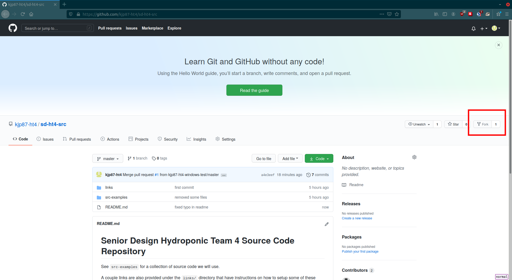

Senior Design Hydroponic Team 4 Source Code Repository
================================================================================
See `src-examples` for a collection of source code we will use. 

A couple links are also provided under the `links/` directory that have 
instructions on how to setup some of these sensors. 

- for a practical dfrobot EC sensor setup, see `links/ec-sensors/df-robot-ec-sensor-v2-wiki`

- for a practical dfrobot pH sensor setup, see `links/ph-sensors/dfrobot-ph-v2-wiki`

- for a practical dht11 sensor setup (atmospheric temp sensor), see `links/temp-sensors/dht11-setup-randomnerdtutorials`

- for a practical ds18b20 sensor setup (aquatic temp sensor), see `links/temp-sensors/ds18b20-setup-randomnerdtutorials`

todo
--------------------------------------------------------------------------------

- need to add lux sensor code 

- need to add peristaltic pump code and links

how to do stuff using git
================================================================================
Git and github are used to write code collaboratively. Git is a program that 
tracks changes to text files. It runs on your machine and keeps snapshots of 
every change you make. Github is a website that holds git repositories (a folder
containing all your work and snapshots). 

When working with git, you usually download a git repository (called cloning) 
from github and work on it from your local machine. When you're done with your 
changes, you upload them to the main git repository on github, where other 
people can use them (called a push). 

how to contribute to this repository
--------------------------------------------------------------------------------
The following shows how to upload a commit on windows using git-bash:

### 0. Have a github account
I'm assuming you have one already. 

### 1. Install git on your machine 
I'm assuming you've done this already. If not, see [the git downloads page](https://git-scm.com/downloads). 

### 2. Configure git with your name and email
*You will only need to do this once.* 

You need to configure git with your name and email. These will be attached to 
all the commits you make. 

	git config --global user.name "Your Name Here"

	git config --global user.email "Your Email Here"

### 3. Fork this repository 
*You will only need to do this once.* 

When you fork a repository on github, you make a copy of `kjp87-ht4/sd-ht4-src` 
under your account `<your github account>/sd-ht4-src`. All changes you make will 
be sent there (more on this below). To get your changes in the main repo, you 
will need to submit a pull request (more on this below). 

### 4. Clone your forked repository onto your local machine
*You will only need to do this once.* 

To do any work on your repo, you need to download it from github. 

	git clone https://github.com/<your github account>/sd-ht4-src.git

### 5. Create a branch to work on
You're not supposed to work directly on the master branch, even if it's on your
own forked version of the original repo. The usual process of making changes 
is:

1. Make a branch

2. Make changes in that branch

3. Merge your changes into master

4. Delete the branch (optional)

to make a branch, do

	git checkout -b "Name of Branch"

### 6. Make changes
Once the repo is on your local machine, you can make any changes you want. All 
your changes can be reversed later, so do whatever you want. You are not limited
to git-bash when making changes - feel free to use an IDE or something. 

### 7. Add your changes to the 'staging area'
Once you've made your changes, add them to the staging area. Everything you add
will be saved into a snapshot once you make a commit. 

	git add *

### 8. Make a commit
The process of taking a snapshot is called making a commit. Git tracks commits. 
When you roll back changes, you take everything back to the state it was in at 
any given commit. 

To make a commit:

	git commit -m "commit message"

When you make a commit, you need to write a small message about what you did. 
git-bash will do this in an editor called 'vim'. Vim is an old editor that is
hard to learn. You can skip using it by using `-m`. If you use vim on accident,
you can exit by typing `<escape>`, then `:q!`. 
